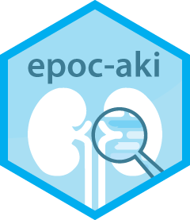

# The EPOC-AKI Study 

Evaluation of the Predictive value of short-term Oliguria and minor Creatinine increases for Acute Kidney Injury in ICU

Austin Health ResearchFest 2020: [Virtual Poster Presentation](https://doi.org/10.6084/m9.figshare.13055699.v1)

## Data Overview

### Definitions


Changes in Creatinine Episodes:

- Creatinine change during episode (µmol/L): Δcr
- Duration of creatinine change episode (hrs): Δt<sub>cr_ch</sub> = T<sub>i</sub> - (T<sub>i</sub> - δt)
- Time between end of cr change epis and AKI (hrs or NA): Δt<sub>aki</sub> = T<sub>AKI</sub> - T<sub>i</sub>

Oliguria Episodes:

- Time Oliguria identified: T<sub>olig</sub> = T<sub>0</sub>
- Time Oliguria episode started: T<sub>olig_4</sub> = T<sub>0</sub> - 4
- Time between olig epis and AKI (hrs or NA): Δt<sub>aki</sub> - T<sub>AKI</sub> - T<sub>0</sub>

### Exploration


Example: Significant difference in creatinine changes 8 < Δt<sub>cr_ch</sub> < 12 between 'No AKI' and 't<sub>AKI</sub> in 4-8 hrs'

## Running

1. Clone the repository and open the R project file `epoc-aki.Rproj` with RStudio

    ```bash
    git clone git@github.com:AlwinW/epoc-api.git
    ```

2. Preview the relevant `bookdown` file

   - Option 1: Open the file directly in RStudio

      1. Open up the bookdown index, e.g. `doc/full/index.Rmd`
      2. In RStudio run `Addins` > `Preview Book`, or from the console run

        ```R
        bookdown::serve_book()
        ```

   - Option 2: Run `serve_book` from the console

        ```R
        bookdown::serve_book(dir = "doc/full/")
        ```

3. Preview the bookdown site at `http://localhost:4321/` or `http://127.0.0.1:4321/`

## Contributors

Alwin Wang and Lisa Toh

## Acknowledgements

## Activity


## License

[](LICENSE)

- [GPL-3.0 License](https://opensource.org/licenses/GPL-3.0)
- Copyright 2020 © [Alwin Wang](https://github.com/alwinw) and [Lisa Toh](https://github.com/lymt)
