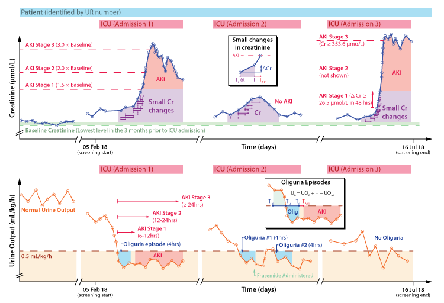

```{r setup}
knitr::opts_chunk$set(
  echo = FALSE,
  message = FALSE,
  cache = TRUE,
  collapse = TRUE,
  comment = "#>"
)

knitr::opts_template$set(silent = list(
  warning = FALSE,
  results = 'hide')
)


rel_path = "../.."
read_R <- function(file) readLines(file.path(rel_path, "R", file))
```

<!-- Consider using CSS to add in epoc-aki logo -->

# Overview{-}

## Aim{-}

New Arterial Blood Gas (ABG) technology provides accurate and validated point-of-care creatinine measurement. Such technology makes it possible to detect small, short-term increases in creatinine levels. We aimed to determine the predictive value of small, short-term creatinine increases for the development of Acute Kidney Injury (AKI) in critically ill patients.

## Methods{-}

In this prospective cohort study, we assessed all the creatinine values from ABGs and laboratory biochemistry results in critically ill patients. We calculated the small, short-term creatinine increases between creatinine values during the patient’s Intensive Care Unit (ICU) admission until the development of KDIGO-defined AKI or ICU discharge or death, whichever occurred first. We evaluated the predictive value of these creatinine increases over varying time periods for AKI development in multivariable analysis with known risk factors such as age and co-morbidities.

<!--```{r overview, echo=FALSE, fig.cap="Overview", out.width="100%"}

```-->

## Results{-}

To come

## Conclusion{-}

To come

```{r 01_config, include=FALSE, cache=FALSE}
# Cannot source this directly or it will override rel_path
knitr::read_chunk(file.path(rel_path, "R/00_config.R"))
```

```{r, load_library_function, opts.label='silent'}
```

```{r environment_setup, opts.label='silent'}
```

## Running{-}

The list of `R` packages used is in `requirements.txt`.  This analysis is carried out using `R version 4.0.2 (2020-06-22)` [@R-base] and the package `tidyverse version 1.3.0` was extensively used [@tidyverse2019]. The package `bookdown version 0.20` [@bookdown2016] was used to create this document.
